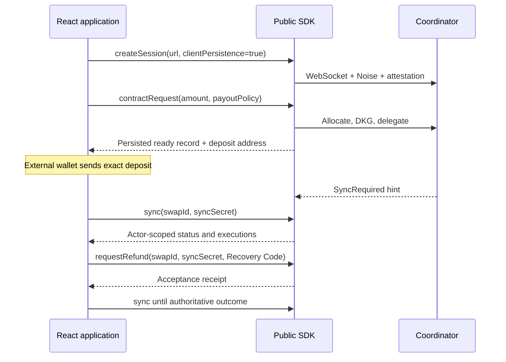

# Copyable Invisible integration

Imports: `react`, `@invisible-labs/sdk`, `/user` and `/events`. The root app selects its route through the SDK's `/presets` entrypoint. Copy every module here; tests are optional in the consuming application.

## Hooks

| Hook | Owns | Main outputs |
| --- | --- | --- |
| `useInvisibleSession(url)` | Explicit connect, attestation violations, disconnect and unmount cleanup | `session`, `phase`, `error`, `connect`, `disconnect`, `fail` |
| `usePrivateTransfers(session, url)` | SDK record loading, selected transfer, serialized create/refund actions | `transfers`, `selected`, `select`, `busy`, `error`, `createTransfer`, `refund`, `reload` |
| `useTransferStatus(session, selected, fail)` | Sync reads and SDK refresh subscriptions | `view`, `fresh`, `error`, `refresh` |

`useInvisibleSession` opts into SDK persistence. After reconnecting, the transfer hook reads existing records without issuing mutations. Status reads pass the selected `swapId` and `syncSecret`. A restored session always attests again.

## Lifecycle

Do not reconstruct SDK wire messages or import its internal files. The deposit address is displayed only for an SDK `ready` record. Refund availability comes from a fresh actor-scoped snapshot, not from a client balance calculation. The coordinator enforces final eligibility and the origin-bound destination.

`useTransferStatus` subscribes only to the selected transfer. It polls every 5 seconds, pauses when the document is hidden and refreshes on return/online. A hint during an active read queues one further read. Transport read failures use the SDK backoff up to 30 seconds; fatal errors stop polling. Explicit reconnect replaces the session and restores record reads. Mutations do not share that retry policy.

When `view` is terminal, stop showing Recovery Codes and deposit instructions. The SDK clears persisted secrets; the example does not append duplicate payout messages, it renders the current sync snapshot.

## Errors

`toUiError` preserves an SDK error's kind/code and uses `normalizeError` for text. Storage errors preserve `swapId` and `remoteAccepted`. Never log whole errors, records, sync secrets, Recovery Codes or signing material.

Render connection errors, command errors and status errors where each action is visible. A transport failure after submission is an unknown outcome. It is not evidence that the coordinator rejected the command.

## Uncertain operations

`mutations.ts` writes a **non-secret** marker before a financial SDK call. Native Web Locks serialize cooperating tabs on the same origin. This marker is local protection, not a protocol idempotency key or a distributed lock.

- Successful creation removes the creation marker.
- An unknown creation outcome keeps it. An SDK `allocation` record also blocks new creation.
- A refund marker remains after acceptance or an unknown outcome until a newer sync version observes a pending refund or a completed refund. Older or unrelated refund history cannot clear it.
- A local SDK validation failure or explicit pre-seal rejection permits a new user-triggered attempt.
- If storage cannot write or Web Locks are unavailable, the command is not submitted.

There is deliberately no "retry anyway" button. If the outcome remains unresolved, verify the original request with the coordinator operator before removing its marker. Marker keys are derived by the exported `mutationKey(url, action)` helper; actions are `create` or `refund:<swapId>`. Deleting a marker does not cancel or reverse an accepted action. Clearing browser storage also destroys these protections and may destroy recovery material.

SDK automatic persistence does not contain the material required for arbitrary pre-delegation resume. Products needing that path must use the SDK's explicit recovery callbacks and `resumePreDelegation` with a protected storage design.

## Customize

Keep the hooks and replace `App.tsx` with your UI. Use the SDK's amount limits and supported payout windows, and its `publicKey`/Recovery Code constructors. Keep `busy`, `creationBlocked`, fresh refund eligibility and cleanup guards when replacing buttons.

If you add refund UI, call `reconcileRefund(status.view)` after a fresh sync and refresh after requesting a refund, as `App.tsx` does. An acceptance receipt must never render as a completed refund.

Wallet connection and deposit submission belong to your existing wallet layer. Do not automatically send or repeat a wallet transaction from a polling effect.
